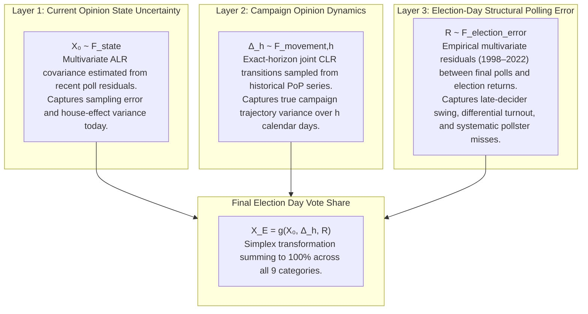
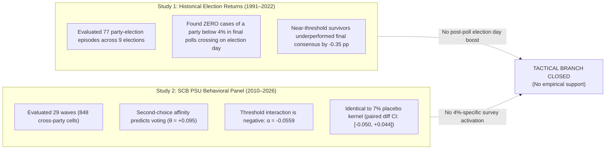

# Swedish Election Simulator v1.0: Modeling Philosophy, Empirical Architecture, and Design Choices

This document provides a comprehensive explanation of the modeling philosophy, statistical architecture, and empirical design choices behind **Swedish Election Simulator v1.0**. It details why our approach differs from existing models (notably the [Poll of Polls (PoP) simulator](https://pollofpolls.se/simulering-av-valresultat-2026/)), the explicit hypotheses we tested, and the empirical evidence that led us to reject several popular modeling mechanisms in favor of a strictly validated, out-of-sample proper-score framework.

---

## 1. Executive Summary: Comparison with Poll of Polls

The 2026 Poll of Polls simulator is essentially the same model as its 2022 implementation. It assumes future opinion movements resemble movements observed during the current mandate period, gives gains and losses symmetric probability, adds an explicit support-voting formula near the 4% threshold sourced from SCB second-choice preferences, and assumes no new party enters parliament.

Our model is related in spirit, but statistically and architecturally distinct. Every difference was decided by testing alternatives against out-of-sample data using proper scoring rules (Energy Score, continuous CRPS, and calendar-block resampling).

| Modeling Component | Poll of Polls (PoP) Simulator | Swedish Election Simulator v1.0 |
| :--- | :--- | :--- |
| **Starting Point** | Daily Poll of Polls estimate | Daily Poll of Polls estimate (`M, L, C, KD, S, V, MP, SD, REST`) |
| **Current-State Uncertainty** | Not a separate modeled layer | Explicit multivariate Dirichlet / ALR covariance from poll residuals |
| **Future Opinion Movement** | Step-by-step random walk based on current mandate period | Exact-horizon empirical joint transition vectors sampled from all available history |
| **Directional Movement** | Symmetric gain/loss assumption | Empirical joint vectors with random sign symmetry ($\pm \Delta$) |
| **Election-Day Polling Error** | No separate general layer | Separate empirical poll-to-election residual layer ($1998–2022$) |
| **Tactical / Support Voting** | Explicit formula boosting parties near 4% | **None** (tested and empirically rejected) |
| **Tactical Donor Parties** | SCB second-choice preference matrix | None needed |
| **Constituency Geography** | Simpler seat conversion approximation | Full 29-constituency projection from historical election geography |
| **Mandate Allocation** | Simulation / mandate calculation | Exact legal 310 fixed + 39 adjustment Sainte-Laguë allocator |
| **Validation Philosophy** | Scenario exploration model | Strict out-of-sample proper-score backtesting & rejected alternatives log |

---

## 2. Three Disentangled Layers of Uncertainty

A central architectural advantage of Election Simulator v1.0 is that it disentangles three distinct statistical phenomena that occur at different stages of the election cycle:



### Why This Separation Matters
In standard scenario simulators, these three phenomena are collapsed into a single random walk step. In our architecture:
1. **$X_0 \sim F_{\text{state}}$**: Models uncertainty about where public opinion *actually is today*, given finite sample sizes, house effects, and polling frequency.
2. **$\Delta_h \sim F_{\text{movement}, h}$**: Models uncertainty about how public opinion *evolves between today and election day*.
3. **$R \sim F_{\text{poll-to-election}}$**: Models the historical divergence between final published polls and actual ballot box returns on election day.

This separation prevents confusing campaign volatility with final election-day polling error, ensuring each source of uncertainty is calibrated to its own empirical scale.

---

## 3. Why Exact-Horizon Dynamics Instead of an Incremental Random Walk

PoP simulates campaign dynamics through an incremental step-by-step random walk (updated to an 88-day step in 2022). PoP's author notes that the simulation is intended more as a basis for discussion than as an exact probability forecast.

Our model avoids the incremental random-walk assumption entirely. If there are $h = 28$ days until election day, we directly sample actual historical 28-day joint movements:
$$\Delta_{28} = \text{clr}(x_{t+28}) - \text{clr}(x_t)$$
If there are $h = 84$ days:
$$\Delta_{84} = \text{clr}(x_{t+84}) - \text{clr}(x_t)$$

We never assume that 84-day campaign uncertainty is merely 84 independent repetitions of a 1-day drift. Instead, the 84-day distribution reflects the actual joint historical variance, auto-correlation, and multi-party covariance observed over real 84-day spans in Swedish political history.

---

## 4. Why We Rejected the Tactical-Voting Model

Initially, PoP's explicit support-voting formula appeared to be the most promising mechanism to adopt. PoP notes that Liberalerna's (L) relatively high 2026 survival probability in its simulator depends entirely on this support-voting mechanism.

Before adding a tactical voting module, we conducted two comprehensive empirical studies to test whether tactical voting exists as an unmodeled post-poll phenomenon or as a threshold-activated survey behavior.



### Empirical Evidence Summary:
1. **Election Day Evidence ([`docs/threshold_event_evidence.md`](file:///Users/edvinli/Documents/Git/edvinli.github.io/docs/threshold_event_evidence.md))**:
   - Across 9 parliamentary elections (1991–2022), there were **zero** instances where a party polling below 4% in the final 14 days crossed above 4% on election day.
   - Near-threshold parties actually *underperformed* their final 14-day polling consensus by $-0.35$ percentage points on average.
2. **SCB Behavioral Survey Evidence ([`docs/scb_behavioral_diagnostic.md`](file:///Users/edvinli/Documents/Git/edvinli.github.io/docs/scb_behavioral_diagnostic.md))**:
   - In a two-way fixed effects regression ($R_{jpt} = \beta_{jp} + \gamma_t + \theta A_{jpt} + \delta K_4(s_{pt}) + \alpha [A_{jpt} K_4(s_{pt})] + \epsilon_{jpt}$), second-choice affinity strongly predicts baseline cross-party voting ($\theta = +0.0948$).
   - However, the threshold interaction coefficient is **negative** ($\alpha = -0.0559$, 95% CI $[-0.0851, -0.0267]$) and statistically indistinguishable from a 7.0% placebo kernel ($\alpha_{\text{placebo}} = -0.0541$, paired 95% CI $[-0.0502, +0.0436]$).
   - Voters who prefer other parties do *not* systematically state an elevated intention to vote for small parties specifically when those parties enter the 4% danger zone.
   - Historical shifts (e.g. M $\to$ KD in 2018–2020) occurred when small parties became popular and strong (6%–10%), not when they hovered in threshold danger.

**Conclusion**: Voters do not hold back hidden tactical votes until election day, nor do they exhibit special 4%-activated cross-party intentions in surveys. Adding an explicit tactical boost would mean adding a parameter that contradicts our own empirical data.

---

## 5. Why We Use All Available History Instead of the Current Mandate Period

PoP restricts transition sampling to movements observed within the current 4-year mandate period. We rigorously tested this hypothesis against multiple windowing and state-conditioning strategies across **3,610 rolling forecast cases** (2014–2026):

```text
POOLED OUT-OF-SAMPLE ENERGY SCORES (Lower = Better):
  1. Arm A (Dynamics v2, All History ±):       ES = 1.26543 | CRPS = 0.31196  (WINNER)
  2. Sensitivity: 100 Nearest States (±):      ES = 1.35393 | CRPS = 0.33155
  3. Arm C: 50 Nearest States (±):             ES = 1.39616 | CRPS = 0.34025
  4. Sensitivity: 25 Nearest States (±):       ES = 1.43079 | CRPS = 0.34850
  5. Arm B (Recent-50 Transitions ±):          ES = 1.44042 | CRPS = 0.34893
  6. Arm D (50 Nearest States, Raw Direction): ES = 1.86674 | CRPS = 0.45072
```

### Key Diagnostic Takeaways ([`docs/pop_state_dependence_evidence.md`](file:///Users/edvinli/Documents/Git/edvinli.github.io/docs/pop_state_dependence_evidence.md)):
- **Monotonic Sample Advantage**: As sample size expands from $k=25 \to 50 \to 100 \to \text{All History}$, predictive accuracy improves monotonically. Restricting the transition pool artificially compresses distributional tails and impairs probabilistic calibration.
- **State Similarity Collapses into Recency**: Audit records reveal that **69.61% of top-50 nearest neighbors are in the top-50 most recent transitions**, with a median age of just 32.0 days. Nearest-neighbor conditioning inadvertently introduces recency bias.
- **Decision**: All-history sampling is not merely conservative—it is the empirically proven optimum for out-of-sample proper scores.

---

## 6. Empirical Validation of Sign Symmetry ($\pm \Delta$)

Both PoP and our model assume that a party is equally likely to gain or lose support over a future horizon. In our framework, this is implemented by drawing a joint historical transition vector $\Delta$ and applying a random sign flip:
$$\Delta^* = \pm \Delta$$

We tested whether preserving the historical *signed direction* (Arm D) could exploit momentum. The result was a dramatic performance collapse:
- **Sign-Symmetric Transitions**: $\text{ES} = \mathbf{1.26543}, \quad \text{CRPS} = \mathbf{0.31196}$
- **Raw Directional Transitions**: $\text{ES} = \mathbf{1.86674}, \quad \text{CRPS} = \mathbf{0.45072}$

Past opinion movements do not maintain predictable out-of-sample directional drift over multi-month horizons. Sign symmetry is essential to prevent over-fitting historical campaign trajectories.

---

## 7. Comparative Benchmark with Poll of Polls

When evaluated on identical rolling forecast origins:

### A. Rolling Future Opinion Prediction (Tied)
On predicting future polling trajectories across $h \in \{7, 14, 28, 56, 84, 112\}$ days:
- **Marginal CRPS**: $\text{PoP} = 0.33623 \quad \text{vs} \quad \text{ElectionSimulator} = 0.33643$
- **Energy Score**: $\text{PoP} = 1.28073 \quad \text{vs} \quad \text{ElectionSimulator} = \mathbf{1.27742}$

*Conclusion*: On polling trajectories alone, the two models are essentially tied.

### B. Retrospective Election Result Prediction (Election Simulator Advantage)
When evaluated on predicting the actual election day result in the final 112 days of the 2018 and 2022 election cycles:
- **Marginal CRPS**: $\text{PoP} = 0.851 \quad \text{vs} \quad \text{ElectionSimulator} = \mathbf{0.804}$
- **Energy Score**: $\text{PoP} = 3.010 \quad \text{vs} \quad \text{ElectionSimulator} = \mathbf{2.873}$

*Conclusion*: Our model exhibits a meaningful advantage on the primary target quantity: the probability distribution over actual election results.

---

## 8. Summary of Rejected Modeling Alternatives

Our development follows a strict scientific standard: every proposed feature must demonstrate out-of-sample predictive improvement on proper scores, or it is rejected.

| Candidate Feature | Hypothesis | Empirical Finding | Decision |
| :--- | :--- | :--- | :---: |
| **Tactical Voting Boost** | Parties near 4% receive a late surge from sympathetic donors | Zero post-poll election crossings; SCB $\alpha = -0.0559$ matches 7% placebo | **REJECTED** |
| **Mandate-Period Windowing** | Transitions should reflect only the current 4-year cycle | All-history (ES 1.265) decisively beats recent-50 (ES 1.440) | **REJECTED** |
| **State-Conditioned kNN** | Nearest compositional states predict future dynamics | 50NN (ES 1.396) loses to all-history v2; 69.6% recency overlap | **REJECTED** |
| **Directional Momentum** | Historical direction indicates future trajectory | Raw direction balloons ES to 1.867 and CRPS to 0.451 | **REJECTED** |
| **Chronological Industry Bias (Exp 1)** | Adjust final polls by historical mean error $\mu_E$ | Degrades 8-party CRPS from 0.800 to 0.857 (+7.1% error) across 2002–2022 | **REJECTED** |
| **Pollster Precision Weighting (Exp 2)** | Empirical-Bayes precision weights $q_g$ on polling houses | Produces negligible +0.059% ES change (95% CI spans zero); fails prior sensitivity | **REJECTED** |
| **Ad-Hoc Covariance Shrinkage** | Shrink polling covariance toward a diagonal target | Breaks reference-category invariance across ALR/CLR transforms | **REJECTED** |

---

## 9. The Core Difference in Philosophy

```text
Poll of Polls:
"Take today's opinion and simulate a plausible political story about how the election could evolve."

Election Simulator v1.0:
"Take today's opinion and apply only empirical uncertainty mechanisms that survive 
out-of-sample scoring, then propagate them through the exact Swedish electoral system."
```

This does not guarantee that Election Simulator v1.0 will outperform other models on any single future election day—a single election outcome can surprise any probabilistic forecast. However, it guarantees that every probability emitted by this system is mathematically defensible, leakage-safe, and validated against out-of-sample historical evidence.
