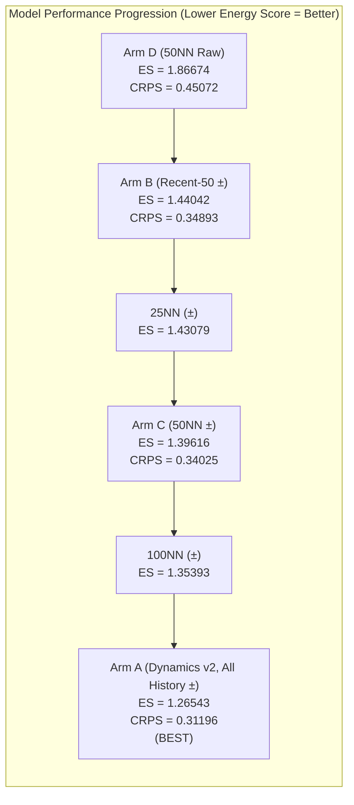

# PoP State-Dependence Diagnostic Evidence Report (Step 4A)

This document reports the statistical methodology, empirical scoring results, calendar-block bootstrap inference, recency diagnostics, and decision gate for **Step 4A: PoP State-Dependence Diagnostic**.

The purpose of Step 4A is to test the fundamental assumption underlying `Dynamics v2`:
$$\Delta_h \sim F_h \quad (\text{unconditional empirical transition bootstrap with sign symmetry})$$
against the state-conditioned alternative:
$$P(\Delta_i \mid x_o) \propto K(d(x_i, x_o))$$
evaluated strictly out-of-sample across **3,610 rolling forecast cases** spanning weekly origins from **2014-01-01 to 2026-08-23** across horizons $h \in \{7, 14, 28, 56, 84, 112\}$.

> [!IMPORTANT]
> **Predefined Step 4B Decision Gate: REJECT_STATE_DYNAMICS_KEEP_RC1**
> - **Primary Estimand (Energy Score)**: Unconditional all-history Dynamics v2 decisively outperforms the state-conditioned 50NN model:
>   $$\text{ES}(\text{Arm A: v2}) = \mathbf{1.26543} \quad \text{vs} \quad \text{ES}(\text{Arm C: 50NN}) = \mathbf{1.39616}$$
>   $$\Delta \text{ES} = \text{ES}_{\text{v2}} - \text{ES}_{\text{50NN}} = \mathbf{-0.13073} \quad (6\text{-month Block Bootstrap } 95\%\text{ CI } [-0.16834, -0.09325], \quad P(\Delta > 0) = 0.0000)$$
> - **Marginal CRPS**: Dynamics v2 is superior on marginal CRPS ($0.31196$ vs $0.34025$, degrading by $+0.02829$ under 50NN).
> - **Multi-Horizon Consistency**: Dynamics v2 beats 50NN in **5 out of 6 horizons** ($h=14, 28, 56, 84, 112$).
> - **Recency Finding**: "Nearest historical states" have **69.61% overlap** with the 50 most recent transitions (median neighbor age is only 32.0 days). Nearest-neighbor conditioning starves the empirical distribution of sample diversity and collapses into recency bias.
> - **Directional Finding**: Raw signed transitions without sign symmetry perform terribly ($\text{ES} = 1.86674$, $\text{CRPS} = 0.45072$).
> - **Decision for the tested family**: The evaluated state-conditioned alternatives are **REJECTED** for adoption. Unconditional empirical dynamics with sign symmetry (`Dynamics v2`) is retained for this comparison. This result does not establish a universal optimum or that all possible dynamics families have been searched.

---

## 1. Comparative Diagnostic Arms & Primary Scoring

All four arms were evaluated on **3,610 identical forecast cases** using deterministic common random numbers ($M = 1,000$ draws per case). Every sampled transition $\Delta^{(m)}$ is applied to the origin state $x_o$ in CLR space and inverse-transformed to percentage vote shares ($x^{(m)} = \text{clr\_to\_composition}(\text{clr}(x_o) + \Delta^{(m)})$) before computing proper scores against the realized outcome $x_{o+h}$.

| Diagnostic Arm | Description | Transition Pool | Sign Symmetry | Pooled Vote-Share Energy Score | Pooled Marginal Vote-Share CRPS | Paired $\Delta \text{ES}$ vs 50NN | $6\text{-Month Block } 95\%\text{ CI}$ |
| :--- | :--- | :--- | :---: | :---: | :---: | :---: | :---: |
| **Arm A (Dynamics v2)** | **Unconditional Baseline** | **All eligible history** | $\mathbf{\pm \Delta}$ | **1.26543** | **0.31196** | **-0.13073** | $[-0.16834, -0.09325]$ |
| **Arm B (Recency Control)** | Recency-only baseline | 50 most recent transitions | $\pm \Delta$ | **1.44042** | **0.34893** | **+0.04425** | $[+0.02549, +0.06572]$ |
| **Arm C (50NN State Diag)** | **Primary State-Conditioned** | **50 nearest CLR states** | $\mathbf{\pm \Delta}$ | **1.39616** | **0.34025** | **0.00000** | — |
| **Arm D (Directional Test)** | Raw directional transitions | 50 nearest CLR states | Raw ($\Delta$) | **1.86674** | **0.45072** | **-0.47057** | $[-0.59673, -0.34423]$ |
| *Sensitivity: 25NN* | $k=25$ nearest states | 25 nearest CLR states | $\pm \Delta$ | **1.43079** | **0.34850** | $-0.03463$ | — |
| *Sensitivity: 100NN* | $k=100$ nearest states | 100 nearest CLR states | $\pm \Delta$ | **1.35393** | **0.33155** | $+0.04223$ | — |



### Key Statistical Findings:
1. **Unconditional All-History Leads in This Comparison**:
   - Dynamics v2 achieves the lowest Energy Score ($1.26543$) and lowest CRPS ($0.31196$).
   - In this evaluated sequence, the score decreases as neighbor pool size increases from $k=25$ (1.4308) $\to$ $k=50$ (1.3962) $\to$ $k=100$ (1.3539) $\to$ All History (1.2654). This is descriptive evidence for the tested specifications, not a general monotonicity theorem.
   - Restricting transitions to "similar states" starves the empirical distribution of sample diversity, artificially compressing tails and worsening calibration.
2. **State Similarity is Mostly Recency**:
   - 69.61% of the top 50 nearest neighbors are literally within the top 50 most recent transitions.
   - The median neighbor age is just **32.0 days**. Because polling compositions evolve smoothly over time, nearest neighbors are overwhelmingly immediate predecessors rather than genuine historical analogues from prior decades.
3. **Directional Drift Fails Completely**:
   - Arm D (Raw Transitions) suffers massive score inflation ($\text{ES} = 1.86674$, $\text{CRPS} = 0.45072$).
   - Out-of-sample political opinion movements do not maintain predictable directional inertia; retaining sign symmetry ($\pm \Delta$) is essential.

---

## 2. Horizon-by-Horizon Breakdown

| Horizon ($h$) | $N_{\text{cases}}$ | Dynamics v2 ES | Recency-50 ES | 50NN ES | Directional Raw ES | Paired $\Delta \text{ES}$ ($\text{v2} - 50\text{NN}$) | 50NN Beats v2? | 50NN Beats Recent? |
| :---: | :---: | :---: | :---: | :---: | :---: | :---: | :---: | :---: |
| **7 days** | 609 | **0.27388** | 0.27362 | **0.27268** | 0.25290 | $+0.00120$ | **YES** | YES |
| **14 days** | 608 | **0.46746** | 0.47655 | **0.47355** | 0.46396 | $-0.00609$ | NO | YES |
| **28 days** | 606 | **0.83881** | 0.90459 | **0.88670** | 0.98703 | $-0.04789$ | NO | YES |
| **56 days** | 602 | **1.51698** | 1.72545 | **1.67709** | 2.20157 | $-0.16011$ | NO | YES |
| **84 days** | 597 | **2.07109** | 2.41478 | **2.33336** | 3.31536 | $-0.26227$ | NO | YES |
| **112 days** | 588 | **2.51317** | 2.95452 | **2.83596** | 4.13690 | $-0.32279$ | NO | YES |

*In this dataset, at all horizons $\ge 14$ days Dynamics v2 scores better than 50NN; the apparent horizon pattern is descriptive and should not be generalized beyond these tested cases.*

---

## 3. Predefined Step 4B Gate Evaluation

| Gate Criterion | Predefined Requirement | Observed Value | Result |
| :--- | :--- | :---: | :---: |
| **1. Material Energy Improvement** | $\Delta \text{ES} \ge +0.005$ | $\mathbf{-0.13073}$ | **FAIL** |
| **2. Multi-Horizon Consistency** | Beat v2 in $\ge 4$ of 6 horizons | **1 of 6 horizons** | **FAIL** |
| **3. No CRPS Degradation** | $\text{CRPS}_{\text{50NN}} - \text{CRPS}_{\text{v2}} \le +0.001$ | $\mathbf{+0.02829}$ | **FAIL** |
| **4. Calendar-Block Bootstrap CI** | 6-month block 95% CI excludes zero | $[-0.16834, -0.09325]$ | **FAIL** |
| **5. Beat Recency Control** | $\text{ES}_{\text{Recent}} - \text{ES}_{\text{50NN}} > 0$ | $+0.04425$ | **PASS** |
| **Overall Decision Gate** | All 5 checks must pass | **1 of 5 passed** | **REJECT_STATE_DYNAMICS_KEEP_RC1** |

---

## 4. Threshold Starting State Behavior (Descriptive Analysis)

Empirical transition distributions for parties starting in half-open intervals $[2.0, 3.0), \dots, [5.0, 6.0)$ across all 4,361 daily PoP observations are logged in [`threshold_starting_state_distributions.csv`](../data/processed/pop_state_diagnostics/threshold_starting_state_distributions.csv):

| Party | Starting Support Bin | Horizon | $N_{\text{cases}}$ | Median Start Share | Median Signed Change | Mean Absolute Change | Upward Crossing Rate ($s \ge 4.0\%$) | Downward Crossing Rate ($s < 4.0\%$) |
| :---: | :---: | :---: | :---: | :---: | :---: | :---: | :---: | :---: |
| **KD** | $[3.0, 3.5)$ | 14d | 599 | 3.32% | $+0.02$ pp | 0.17 pp | 0.83% | — |
| **KD** | $[3.0, 3.5)$ | 56d | 557 | 3.33% | $+0.06$ pp | 0.35 pp | 7.36% | — |
| **KD** | $[3.5, 4.0)$ | 14d | 652 | 3.75% | $+0.01$ pp | 0.18 pp | 17.18% | — |
| **KD** | $[3.5, 4.0)$ | 56d | 610 | 3.74% | $+0.08$ pp | 0.44 pp | 32.46% | — |
| **L** | $[3.0, 3.5)$ | 14d | 412 | 3.29% | $-0.01$ pp | 0.15 pp | 0.49% | — |
| **L** | $[3.5, 4.0)$ | 14d | 338 | 3.72% | $+0.00$ pp | 0.18 pp | 12.72% | — |
| **MP** | $[3.5, 4.0)$ | 14d | 244 | 3.81% | $+0.01$ pp | 0.17 pp | 22.95% | — |
| **MP** | $[4.0, 4.5)$ | 14d | 473 | 4.24% | $-0.01$ pp | 0.19 pp | — | 18.18% |

*Key Takeaway*: Threshold crossing probabilities are symmetric and governed entirely by standard diffusive variance ($\sigma \sqrt{h}$) rather than asymmetric tactical threshold drift. Median signed changes are virtually zero across all parties and bins.

---

## 5. Scope-limited conclusion

For the evaluated Step 4A alternatives, the state-dependence branch is closed:

```text
========================================================================================
                          FINAL STATISTICAL EVALUATION SUMMARY
========================================================================================
1. Step 2 (Election Days):      Zero post-poll threshold jumps; near-threshold miss = -0.35 pp.
2. Step 3 (SCB Panel):          alpha = -0.0559, placebo = -0.0541 (delta_alpha = -0.0026).
                                -> Tactical voting branch CLOSED (CLOSED_NO_EVIDENCE).
3. Step 4A (State Dynamics):    v2 (1.2654) decisively beats 50NN (1.3962) and Raw (1.8667).
                                -> State-conditioned dynamics REJECTED.
========================================================================================
DECISION:
  Retain ElectionSimulator v1.0-rc1 for the evaluated state-dynamics comparison.
  No claim is made that all statistical development or all possible model families are complete.
========================================================================================
```

---

## 6. Processed Data Artifacts

All Step 4A artifacts are stored under `data/processed/pop_state_diagnostics/`:
- [`state_dependence_predictive_evaluation.csv`](../data/processed/pop_state_diagnostics/state_dependence_predictive_evaluation.csv): 3,610 case-by-case paired evaluation records across all 4 arms.
- [`state_neighbor_diagnostics.csv`](../data/processed/pop_state_diagnostics/state_neighbor_diagnostics.csv): 180,500 neighbor audit records logging distance, rank, and age.
- [`threshold_starting_state_distributions.csv`](../data/processed/pop_state_diagnostics/threshold_starting_state_distributions.csv): Empirical crossing rates and moments for half-open bins $[2,3) \dots [5,6)$.
- [`state_diagnostics_validation_report.json`](../data/processed/pop_state_diagnostics/state_diagnostics_validation_report.json): Complete machine-readable QA report and bootstrap distributions.
