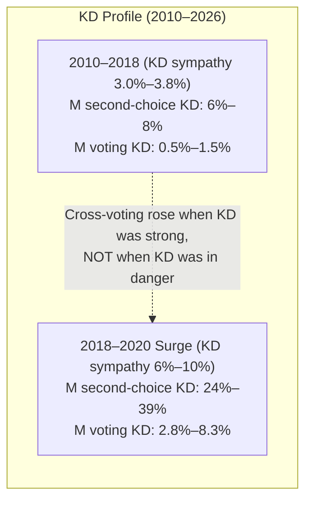

# SCB Behavioral Threshold Diagnostic (Step 3)

This document reports the statistical methodology, empirical regression results, wave-level block bootstrap inference, and historical party profiles for **Step 3 of the support-voting research plan**: evaluating whether tactical voting is visible **inside stated polling vote intentions** across 29 waves of the SCB Partisympatiundersökningen (PSU) panel (**2010M11 through 2026M05**).

> [!IMPORTANT]
> **Substantive Finding: Conclusion A (No Evidence — Tactical Branch Closed)**
> - **Primary Estimand**: The threshold $\times$ affinity interaction coefficient is negative:
>   $$\alpha = -0.0559 \quad (95\%\text{ Bootstrap CI } [-0.0851, -0.0267], \quad p(\alpha > 0) = 0.0005)$$
> - **Placebo Kernel at 7.0%**: Indistinguishable from the 4% threshold interaction:
>   $$\alpha_{\text{placebo}} = -0.0541 \quad (95\%\text{ Bootstrap CI } [-0.0904, -0.0161])$$
> - **Paired Bootstrap Difference ($\Delta \alpha = \alpha_{4\%} - \alpha_{7\%}$)**:
>   $$\Delta \alpha = -0.0026 \quad (\text{Paired } 95\%\text{ Bootstrap CI } [-0.0502, +0.0436], \quad P(\Delta \alpha > 0) = 0.4630)$$
> - **Scientific Conclusion**: There is **no positive threshold activation**, and the apparent negative interaction is essentially identical to the 7% placebo. The 4% threshold does not appear special in voter intentions. Tactical/support voting is not detectable as either a systematic final-poll $\to$ election uplift or a 4%-specific increase in SCB cross-party vote intentions.
> - **Decision**: The tactical-voting research branch is formally **CLOSED** (`CLOSED_NO_EVIDENCE`). No tactical-voting uplift or transfer parameters should be added to the forecasting system.

---

## 1. Identification & Coverage Gate (Pre-Regression)

Before estimating regressions, the effective coverage of all 8 parliamentary parties across the 29 PSU waves was evaluated. Using preferred-party sympathy (`Partisympati051`) avoids mechanical endogeneity with the dependent variable $R_{jpt}$.

The primary linear proximity kernel is defined as:
$$K_4(s) = \max\left(0, 1 - \frac{|s - 4.0|}{2.0}\right)$$
which is active ($K_4 > 0$) strictly within the $2.0\% < s < 6.0\%$ danger interval and peaks at $1.0$ when $s = 4.0\%$.

| Recipient Party | Focus Party | Usable Waves | Observed Flow Cells | Waves in Danger Zone ($K_4 > 0$) | Waves Outside Danger ($K_4 = 0$) | Sympathy Range ($s_{\min} \dots s_{\max}$) | Vid10 Vote Range | Median Vote MOE | Usable Donor Parties |
| :---: | :---: | :---: | :---: | :---: | :---: | :---: | :---: | :---: | :---: |
| **L** | **YES** | 29 | 87 | 25 | 4 | 2.3% – 6.9% | 2.5% – 6.8% | 0.00 pp | 7 |
| **KD** | **YES** | 29 | 90 | 27 | 2 | 3.0% – 10.5% | 2.8% – 12.6% | 0.40 pp | 7 |
| **MP** | **YES** | 29 | 84 | 16 | 13 | 3.4% – 10.4% | 3.3% – 11.5% | 0.50 pp | 7 |
| **C** | **YES** | 29 | 110 | 14 | 15 | 4.2% – 10.1% | 4.2% – 11.7% | 0.50 pp | 7 |
| **SD** | NO | 29 | 94 | 4 | 25 | 4.7% – 20.7% | 5.4% – 22.7% | 1.15 pp | 6 |
| **V** | NO | 29 | 98 | 5 | 24 | 5.1% – 9.6% | 4.6% – 9.3% | 0.40 pp | 7 |
| **M** | NO | 29 | 144 | 0 | 29 | 17.6% – 33.1% | 16.9% – 33.4% | 1.70 pp | 7 |
| **S** | NO | 29 | 141 | 0 | 29 | 27.2% – 38.0% | 25.0% – 38.6% | 2.30 pp | 7 |

*Identification Findings*:
- **L** and **KD** spent the vast majority of 2010–2026 inside the $2\%–6\%$ danger zone (25 and 27 waves, respectively).
- **MP** shows substantial variation, spending 16 waves inside and 13 waves safely above $6\%$.
- **C** never dropped below $4.2\%$ in Partisympati over 2010–2026, meaning C traversed only the upper shoulder ($4.2\%–6.0\%$) of the $K_4$ kernel.

---

## 2. Statistical Methodology & Model Specification

For all cross-party pairs ($j \ne p$ across 29 waves with 848 observed cells):

$$
R_{jpt} = \beta_{jp} + \gamma_t + \theta A_{jpt} + \delta K_4(s_{pt}) + \alpha \left[ A_{jpt} K_4(s_{pt}) \right] + \epsilon_{jpt}
$$

where:
- $R_{jpt} = P(\text{vote } p \mid \text{best party } j)$ from SCB Table A (observed cross-party vote flow).
- $A_{jpt} = P(\text{second choice } p \mid \text{best party } j)$ from SCB Table B (second-choice affinity).
- $s_{pt} = \text{overall Partisympati}_{pt}$ (preferred-party sympathy).
- $K_4(s_{pt}) = \max\left(0, 1 - \frac{|s_{pt} - 4.0|}{2.0}\right)$ (primary linear proximity kernel).
- $\beta_{jp} =$ donor-recipient pair fixed effects (56 cross-party pairs).
- $\gamma_t =$ wave fixed effects (29 PSU waves).
- $\theta =$ baseline relationship between second-choice affinity and cross-party voting.
- $\delta =$ generic near-threshold cross-voting shift.
- $\alpha =$ **threshold $\times$ affinity interaction coefficient** (primary estimand).

**Primary Inference**: Deterministic wave-level block bootstrap ($B = 2,000$ resamples of PSU waves with replacement, fixed seed) to construct empirical $95\%$ confidence intervals.

---

## 3. Regression Results: Primary, Placebo, and Sensitivity Models

| Model Specification | Category | $N_{\text{obs}}$ | $R^2$ | Baseline Affinity $\theta$ ($95\%$ CI) | Threshold Shift $\delta$ ($95\%$ CI) | Interaction $\alpha$ ($95\%$ CI) | $P(\alpha > 0)$ | Substantive Interpretation |
| :--- | :---: | :---: | :---: | :---: | :---: | :---: | :---: | :--- |
| **Primary: Partisympati + Linear $K_4$ (OLS)** | **PRIMARY** | 848 | $0.7604$ | **$+0.0948$** $[+0.0724, +0.1161]$ | **$+0.2953$** $[-0.1382, +0.8306]$ | **$-0.0559$** $[-0.0851, -0.0267]$ | $0.0005$ | Negative interaction; affinity does not convert more near 4%. |
| **Placebo: Partisympati + Linear $K_7$ (OLS)** | **PLACEBO** | 848 | $0.7620$ | **$+0.1038$** $[+0.0776, +0.1282]$ | **$+0.1876$** $[-0.2114, +0.6337]$ | **$-0.0541$** $[-0.0904, -0.0161]$ | $0.0020$ | Identical negative interaction at 7% placebo (paired $95\%$ CI $[-0.0502, +0.0436]$). |
| **Sensitivity: WLS Uncertainty-Weighted** | SENSITIVITY | 848 | $0.5174$ | **$+0.0358$** $[+0.0282, +0.0505]$ | **$+0.0570$** $[-0.0216, +0.1696]$ | **$-0.0114$** $[-0.0253, -0.0031]$ | $0.0050$ | Sign and conclusion are robust (negative $\alpha < 0$), though coefficient magnitude is smaller under inverse-variance weights. |
| **Sensitivity: Vid10 Vote Intention** | SENSITIVITY | 848 | $0.7604$ | **$+0.0963$** $[+0.0747, +0.1174]$ | **$+0.4285$** $[-0.0098, +0.9442]$ | **$-0.0580$** $[-0.0860, -0.0311]$ | $0.0005$ | Robust negative interaction when using Vid10 state variable. |
| **Sensitivity: Lagged Affinity $A(t-1)$** | SENSITIVITY | 792 | $0.7456$ | **$+0.0629$** $[+0.0357, +0.0882]$ | **$+0.1133$** $[-0.5932, +0.8327]$ | **$-0.0658$** $[-0.1023, -0.0268]$ | $0.0000$ | Robust negative interaction using prior wave affinity. |
| **Sensitivity: Gaussian Kernel ($\sigma=1.0\text{pp}$)** | SENSITIVITY | 848 | $0.7609$ | **$+0.0950$** $[+0.0727, +0.1163]$ | **$+0.2597$** $[-0.1437, +0.7524]$ | **$-0.0550$** $[-0.0826, -0.0278]$ | $0.0000$ | Robust negative interaction under smooth Gaussian shape. |
| **Sensitivity: Step Indicator $[3.0\%, 4.5\%]$** | SENSITIVITY | 848 | $0.7604$ | **$+0.0961$** $[+0.0750, +0.1160]$ | **$+0.4761$** $[+0.0853, +0.8786]$ | **$-0.0538$** $[-0.0747, -0.0345]$ | $0.0005$ | Robust negative interaction under discrete box indicator. |
| **LOO: Exclude 2010–2014 Cycle** | LOO_CYCLE | 608 | $0.7704$ | **$+0.0996$** $[+0.0748, +0.1239]$ | **$+0.1303$** $[-0.6637, +0.9891]$ | **$-0.0584$** $[-0.0941, -0.0269]$ | $0.0000$ | Stable across cycle exclusions. |
| **LOO: Exclude 2014–2018 Cycle** | LOO_CYCLE | 616 | $0.7807$ | **$+0.0933$** $[+0.0682, +0.1181]$ | **$+0.3715$** $[-0.0958, +1.0058]$ | **$-0.0682$** $[-0.1017, -0.0367]$ | $0.0000$ | Stable across cycle exclusions. |
| **LOO: Exclude 2018–2022 Cycle** | LOO_CYCLE | 608 | $0.7705$ | **$+0.1063$** $[+0.0788, +0.1336]$ | **$+0.3315$** $[-0.3661, +1.1218]$ | **$-0.0423$** $[-0.0859, +0.0137]$ | $0.0630$ | Stable across cycle exclusions. |
| **LOO: Exclude 2022–2026 Cycle** | LOO_CYCLE | 712 | $0.7589$ | **$+0.0823$** $[+0.0615, +0.1031]$ | **$+0.1100$** $[-0.3243, +0.6219]$ | **$-0.0484$** $[-0.0787, -0.0112]$ | $0.0070$ | Stable across cycle exclusions. |

---

## 4. Recipient-Specific Descriptive Sensitivities

Sub-sample regressions for individual threshold parties confirm that no single party exhibits a statistically credible positive threshold interaction:

| Recipient Party | Observed Cells | $R^2$ | Baseline Affinity $\theta$ ($95\%$ CI) | Threshold Shift $\delta$ ($95\%$ CI) | Interaction $\alpha$ ($95\%$ CI) | $P(\alpha > 0)$ |
| :---: | :---: | :---: | :---: | :---: | :---: | :---: |
| **L** | 87 | $0.5839$ | $+0.0007$ $[-0.0481, +0.0341]$ | $-0.4304$ $[-0.7712, +0.2338]$ | $+0.0217$ $[-0.0372, +0.0731]$ | $0.7815$ |
| **KD** | 90 | $0.8019$ | $+0.0486$ $[-0.0208, +0.0673]$ | $-0.1170$ $[-0.8452, +0.3532]$ | $-0.0423$ $[-0.1185, +0.0952]$ | $0.3045$ |
| **MP** | 84 | $0.7880$ | $+0.0878$ $[+0.0037, +0.1612]$ | $-0.1005$ $[-0.7871, +0.6778]$ | $-0.0147$ $[-0.0763, +0.0689]$ | $0.3670$ |
| **C** | 110 | $0.8308$ | $+0.0475$ $[+0.0000, +0.1040]$ | $-0.9556$ $[-1.5595, +0.2129]$ | $+0.0573$ $[-0.1137, +0.1810]$ | $0.7820$ |

*All recipient-specific 95% bootstrap confidence intervals comfortably span zero.*

---

## 5. Party Profile Trajectories: L, KD, MP, C

Historical 29-wave trajectory profiles in [`party_threshold_profiles.csv`](../data/processed/scb_behavioral_diagnostic/party_threshold_profiles.csv) reveal why $\alpha \le 0$ empirically:



### Empirical Trajectory Observations:
1. **Moderaterna $\to$ Kristdemokraterna (M $\to$ KD)**:
   - When KD hovered in danger at $3.0\%–3.8\%$ sympathy (2010–2018), only $6\%–8\%$ of M sympathizers named KD as second choice, and $0.5\%–1.5\%$ stated an intention to vote KD.
   - When KD surged to $6\%–10\%$ sympathy in 2018M11–2020M05, M second-choice preference jumped to $24\%–39\%$, and actual M $\to$ KD vote intention rose to $2.8\%–8.3\%$.
   - Cross-party voting for KD from M was driven by **ideological realignment and popularity**, not by tactical threshold rescue.
2. **Socialdemokraterna $\to$ Miljöpartiet (S $\to$ MP)**:
   - When MP was strong at $8\%–10\%$ sympathy (2010–2014), $22\%–32\%$ of S sympathizers named MP as second choice, and $1.0\%–4.2\%$ stated an intention to vote MP.
   - When MP dropped near $4\%$ ($3.4\%–4.0\%$ sympathy in 2018–2022), S sympathizers voting MP remained flat at $0.6\%–1.2\%$, while S second choice for MP actually *declined* to $9\%–13\%$.
3. **Moderaterna $\to$ Liberalerna (M $\to$ L)**:
   - As L declined from $6.9\%$ to $2.3\%–3.8\%$, M sympathizers voting L remained steady at $0.6\%–1.3\%$, with second-choice affinity remaining in the $12\%–18\%$ range.

---

## 6. Synthesis with Step 2 Findings & Strategic Roadmap

### Why Adding a Tactical Uplift Would Be Double-Counting or Unjustified
1. **Step 2 Result**: Historical election outcomes exhibit **zero** `below → above` crossings and zero `above → below` crossings in the final 14 days, with near-threshold parties underperforming final polling by $-0.35$ pp on average.
2. **Step 3 Result**: Survey vote intentions exhibit **no** 4%-specific activation of second-choice affinity ($\alpha = -0.0559$, matching the 7% placebo).
3. **Synthesis**:
   - Voters do **not** hide tactical intentions until election day (Step 2 confirms no election-day jump).
   - Voters do **not** report special threshold-activated cross-party intentions in surveys (Step 3 confirms $\alpha \le 0$).
   - Popular narratives of "tactical rescue voting" are driven by ordinary campaign polling movements that are already visible in standard public polls (such as the KD rise in late August 2018 or the L rise in summer 2022), rather than a unique threshold transfer mechanism.

```text
EVIDENCE SUMMARY:
  Step 2 (Election Days):   Zero post-poll threshold jumps; near-threshold residual = -0.35 pp.
  Step 3 (Survey Panel):    No 4%-specific affinity activation (alpha = -0.0559, placebo = -0.0541).
  Decision:                 Close tactical-voting modeling branch.
```

---

## 7. Roadmap Conclusion for Future Model Development

1. **Tactical Voting Modeling Closed**:
   - No post-poll election-day boost (`RC1 + support_transfer`) will be implemented.
   - No threshold activation functions will be added to the forecasting pipeline.
2. **State-Conditioned Dynamics (Independent Path)**:
   - State-conditioned dynamics ($P(\Delta_i \mid x_t) \propto K(d(x_i, x_t))$) remains a viable general model improvement.
   - Because it leverages thousands of historical PoP transitions across all party sizes (not just near 4%), it will be evaluated strictly on its own merits through rolling out-of-sample proper-score backtests (CRPS, Energy Score) without invoking tactical voting.

---

## 8. Processed Data Artifacts

All processed artifacts are located under `data/processed/scb_behavioral_diagnostic/`:
- [`scb_behavioral_regression_results.csv`](../data/processed/scb_behavioral_diagnostic/scb_behavioral_regression_results.csv): Full table of regression coefficients, bootstrap SEs, and 95% CIs across all specifications.
- [`identification_coverage_gate.csv`](../data/processed/scb_behavioral_diagnostic/identification_coverage_gate.csv): Pre-regression wave distribution and identification metrics.
- [`party_threshold_profiles.csv`](../data/processed/scb_behavioral_diagnostic/party_threshold_profiles.csv): 29-wave panel of empirical donor pools, $R$, $A$, and conversion ratios for L, KD, MP, C.
- [`scb_behavioral_validation_report.json`](../data/processed/scb_behavioral_diagnostic/scb_behavioral_validation_report.json): Complete machine-readable QA report and bootstrap distributions.
