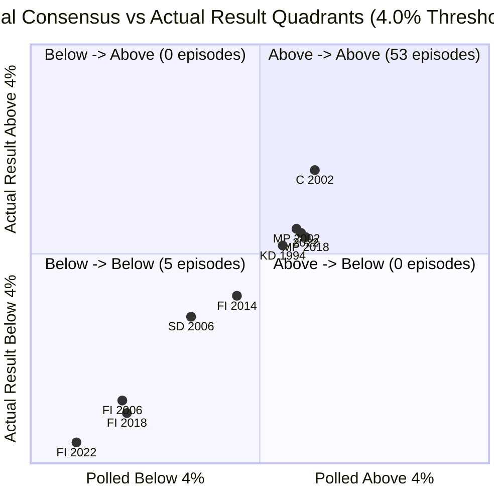

# Historical Party-Election Threshold Evidence (Step 2)

This document presents the descriptive evidence, data provenance, and quality assurance diagnostics for the historical party-election threshold dataset covering Swedish parliamentary elections from **1991 through 2022** (Step 2 of the support-voting research plan).

> [!IMPORTANT]
> **Descriptive Scope Disclaimer**
> This report documents empirical historical residuals between official election results and final pre-election polling consensus:
> $$\text{residual\_pp} = \text{actual\_result\_pct} - \text{final\_poll\_consensus\_pct}$$
> No tactical-voting models, threshold activation kernels, or transfer coefficients are fitted. These descriptive facts serve solely to establish whether election-day polling deviations systematically correlate with threshold proximity.

---

## 1. Target Elections and Inclusion Status

Nine parliamentary elections were evaluated under strict anti-leakage eligibility rules:
- `publication_date <= election_date`
- `interview_end <= election_date`
- `interview_end >= election_date - window_days`
- Non-missing, non-indeterminate `interview_end` and `publication_date`; `interview_start` is optional and retained/audited when unavailable.

| Election | Election Date | Canonical 14d Status | Sensitivity Window | Usable Polls (14d) | Pollsters (14d) | Quality / Exclusion Rationale |
| :--- | :---: | :---: | :---: | :---: | :---: | :--- |
| **1991** | 1991-09-15 | **EXCLUDED** | 21d Sensitivity | 0 | 0 | Single pre-election poll ended $E-18\text{d}$ (outside 14d window). Eligible for 21d sensitivity. |
| **1994** | 1994-09-18 | **INCLUDED** | 7d, 14d, 21d | 1 | 1 | Included with **LOW** grade (single pollster Ipsos/TEMO in 14d window, $n=1,358$). |
| **1998** | 1998-09-20 | **EXCLUDED** | **EXCLUDED** | 0 | 0 | Excluded from all windows due to missing/indeterminate interview dates in SwedishPolls. |
| **2002** | 2002-09-15 | **INCLUDED** | 7d, 14d, 21d | 44 | 7 | High-volume multi-house consensus (**MEDIUM** for parliamentary parties; 42.86% retained-poll N coverage). |
| **2006** | 2006-09-17 | **INCLUDED** | 7d, 14d, 21d | 25 | 5 | Multi-house consensus (**HIGH** for parliamentary parties, **MEDIUM** for SD, **LOW** for FI; 80% retained-poll N coverage). |
| **2010** | 2010-09-19 | **INCLUDED** | 7d, 14d, 21d | 27 | 7 | High-volume multi-house consensus (**HIGH** grade). |
| **2014** | 2014-09-14 | **INCLUDED** | 7d, 14d, 21d | 23 | 9 | High-volume multi-house consensus (**HIGH** grade for 9 parties including FI). |
| **2018** | 2018-09-09 | **INCLUDED** | 7d, 14d, 21d | 35 | 10 | High-volume multi-house consensus (**HIGH** for parl. parties, **MEDIUM** for FI). |
| **2022** | 2022-09-11 | **INCLUDED** | 7d, 14d, 21d | 47 | 8 | High-volume multi-house consensus (**HIGH** for parliamentary parties, **LOW** for FI; 87.5% retained-poll N coverage). |

---

## 2. Dataset Dimensions and Quality Breakdown

The canonical dataset [`party_election_threshold_events.csv`](../data/processed/threshold_events/party_election_threshold_events.csv) contains **77 party-election episodes** across all 9 target elections.

### Quality Grade Counts
- **HIGH (40 episodes, 51.9%)**: $\ge 5$ distinct pollsters, $\ge 15$ eligible polls, $\ge 80\%$ sample size coverage, complete dates.
- **MEDIUM (9 episodes, 11.7%)**: $\ge 3$ distinct pollsters, or $\ge 2$ pollsters and $\ge 5$ eligible polls; this includes all seven 2002 parliamentary-party episodes and FI in 2006/2018.
- **LOW (9 episodes, 11.7%)**: 1 or 2 pollsters (7 parliamentary parties in 1994, FI in 2006, FI in 2022).
- **EXCLUDE (19 episodes, 24.7%)**: 1991 (9 parties), 1998 (8 parties), unpolled SD in 1994, unpolled FI in 2002.

**Total Usable Episodes in Canonical 14d Window**: **58 episodes** (49 Primary `HIGH + MEDIUM`, 9 `LOW`).

### Metadata-retention correction

The canonical run was regenerated after correcting a pandas pivot behavior that
silently discarded eligible polls whenever `sample_size` or `interview_start`
was missing.  Support values are now pivoted by the non-null `poll_id` key and
the metadata is joined afterward, so the documented neutral weight of 1.0 is
actually applied for missing sample size.  The episode count remains 77 and
the usable count remains 58, but the consensus and quality metadata change:

| Election | Before correction | Corrected result | Effect on evidence |
| :---: | :--- | :--- | :--- |
| **2002** | 44 polls, 5 retained pollsters, 100% apparent N coverage | 44 polls, 7 retained pollsters, 42.86% N coverage | All seven parliamentary-party episodes move from HIGH to MEDIUM; consensus values change materially. |
| **2006** | 25 polls, 5 retained pollsters, 100% apparent N coverage | 25 polls, 5 retained pollsters, 80% N coverage | Demoskop's missing-N latest poll is retained with weight 1.0; SD consensus changes and is MEDIUM. |
| **2022** | 47 polls, 7 retained pollsters, 100% apparent N coverage | 47 polls, 8 retained pollsters, 87.5% N coverage | Infostat's missing-N poll is retained with weight 1.0; consensus values change slightly. |

The correction does not change the number of canonical episodes, the zero
below-to-above or above-to-below crossings, or the qualitative conclusion that
this sample provides no evidence of a positive final-fortnight threshold jump.
It does reduce the 14-day near-threshold mean residual from $-0.40$ pp to
$-0.39$ pp (median remains $-0.43$ pp) and makes the historical quality counts
honest rather than treating missing-N polls as absent.

The source-derived official-results snapshot at
`data/raw/threshold_events/official_election_results_archive.json` is
write-once.  Re-running the loader with identical source values is
idempotent; if the source-derived bytes change, the loader fails without
overwriting the existing evidence, so a reviewed revision must be archived
under a new path.

---

## 3. Predefined Threshold Band Summary

Episodes are classified into fixed, pre-registered half-open intervals based on final polling consensus:

### Primary Analysis: HIGH + MEDIUM Quality Episodes ($N=49$)

| Threshold Band | Range ($x = \text{poll\_consensus}$) | Episodes | Mean Residual ($pp$) | Median Residual ($pp$) | Std Dev ($pp$) | Passed $\ge 4\%$ | Failed $< 4\%$ |
| :--- | :--- | :---: | :---: | :---: | :---: | :---: | :---: |
| **$<2$** | $x < 2.0\%$ | 1 | $-0.56$ | $-0.56$ | — | 0 | 1 |
| **$2–3$** | $2.0\% \le x < 3.0\%$ | 1 | $+0.89$ | $+0.89$ | — | 0 | 1 |
| **$3–3.5$** | $3.0\% \le x < 3.5\%$ | 0 | — | — | — | 0 | 0 |
| **$3.5–4$** | $3.5\% \le x < 4.0\%$ | 1 | $-0.59$ | $-0.59$ | — | 0 | 1 |
| **$4–4.5$** | $4.0\% \le x < 4.5\%$ | 0 | — | — | — | 0 | 0 |
| **$4.5–5$** | $4.5\% \le x < 5.0\%$ | 3 | $-0.31$ | $-0.27$ | $0.24$ | 3 | 0 |
| **$5–6$** | $5.0\% \le x < 6.0\%$ | 10 | $-0.19$ | $-0.34$ | $0.48$ | 10 | 0 |
| **$\ge 6$** | $x \ge 6.0\%$ | 33 | $+0.12$ | $-0.16$ | $1.42$ | 33 | 0 |

### All Usable Episodes (Including LOW Quality, $N=58$)

| Threshold Band | Range | Episodes | Mean Residual ($pp$) | Median Residual ($pp$) | Std Dev ($pp$) | Passed $\ge 4\%$ | Failed $< 4\%$ |
| :--- | :--- | :---: | :---: | :---: | :---: | :---: | :---: |
| **$<2$** | $x < 2.0\%$ | 3 | $-0.37$ | $-0.32$ | $0.16$ | 0 | 3 |
| **$2–3$** | $2.0\% \le x < 3.0\%$ | 1 | $+0.89$ | $+0.89$ | — | 0 | 1 |
| **$3–3.5$** | $3.0\% \le x < 3.5\%$ | 0 | — | — | — | 0 | 0 |
| **$3.5–4$** | $3.5\% \le x < 4.0\%$ | 1 | $-0.59$ | $-0.59$ | — | 0 | 1 |
| **$4–4.5$** | $4.0\% \le x < 4.5\%$ | 0 | — | — | — | 0 | 0 |
| **$4.5–5$** | $4.5\% \le x < 5.0\%$ | 4 | $-0.34$ | $-0.35$ | $0.21$ | 4 | 0 |
| **$5–6$** | $5.0\% \le x < 6.0\%$ | 10 | $-0.19$ | $-0.34$ | $0.48$ | 10 | 0 |
| **$\ge 6$** | $x \ge 6.0\%$ | 39 | $+0.10$ | $-0.14$ | $1.36$ | 39 | 0 |

---

## 4. Individual Near-Threshold Episodes (2%–6% Range)

Because aggregate band means are based on small sample sizes, every individual episode with final polling consensus in $[2.0\%, 6.0\%]$ is tabulated below:

| Election | Party | Final Consensus | Actual Result | Residual ($pp$) | Legal Threshold Passed ($25V_p \ge V_{\text{valid}}$) | 4-Quadrant Category | Threshold Band | Quality Grade |
| :---: | :---: | :---: | :---: | :---: | :---: | :---: | :---: | :---: |
| **1994** | KD | 4.50% | 4.07% | **$-0.43$** | YES | `above_to_above` | 4.5–5 | LOW |
| **2002** | C | 5.44% | 6.19% | **$+0.76$** | YES | `above_to_above` | 5–6 | MEDIUM |
| **2002** | MP | 4.74% | 4.65% | **$-0.09$** | YES | `above_to_above` | 4.5–5 | MEDIUM |
| **2006** | MP | 5.77% | 5.24% | **$-0.52$** | YES | `above_to_above` | 5–6 | HIGH |
| **2006** | SD | 2.04% | 2.93% | **$+0.89$** | NO | `below_to_below` | 2–3 | MEDIUM |
| **2006** | V | 5.93% | 5.85% | **$-0.08$** | YES | `above_to_above` | 5–6 | HIGH |
| **2010** | KD | 5.94% | 5.60% | **$-0.35$** | YES | `above_to_above` | 5–6 | HIGH |
| **2010** | SD | 5.11% | 5.70% | **$+0.58$** | YES | `above_to_above` | 5–6 | HIGH |
| **2010** | V | 5.93% | 5.60% | **$-0.33$** | YES | `above_to_above` | 5–6 | HIGH |
| **2014** | FI | 3.72% | 3.12% | **$-0.59$** | NO | `below_to_below` | 3.5–4 | HIGH |
| **2014** | KD | 5.21% | 4.57% | **$-0.64$** | YES | `above_to_above` | 5–6 | HIGH |
| **2018** | L | 5.96% | 5.49% | **$-0.47$** | YES | `above_to_above` | 5–6 | HIGH |
| **2018** | MP | 4.98% | 4.41% | **$-0.57$** | YES | `above_to_above` | 4.5–5 | HIGH |
| **2022** | KD | 5.67% | 5.34% | **$-0.33$** | YES | `above_to_above` | 5–6 | HIGH |
| **2022** | L | 4.88% | 4.61% | **$-0.27$** | YES | `above_to_above` | 4.5–5 | HIGH |
| **2022** | MP | 5.56% | 5.08% | **$-0.48$** | YES | `above_to_above` | 5–6 | HIGH |

---

## 5. Four-Quadrant Threshold Crossing Diagnostics

Episodes are partitioned into four quadrants based on whether final consensus is
above or below 4.0% and whether the exact legal vote-count test
($25V_p \ge V_{\text{valid}}$) passed:

1. **`below -> below` (5 episodes)**:
   - FI 2006 (Poll: 1.00%, Act: 0.68%, Res: $-0.32$ pp)
   - SD 2006 (Poll: 2.04%, Act: 2.93%, Res: $+0.89$ pp)
   - FI 2014 (Poll: 3.72%, Act: 3.12%, Res: $-0.59$ pp)
   - FI 2018 (Poll: 1.02%, Act: 0.46%, Res: $-0.56$ pp)
   - FI 2022 (Poll: 0.30%, Act: 0.05%, Res: $-0.25$ pp)
2. **`below -> above` (0 episodes)**:
   - In the canonical 14-day window across 1994–2022, **zero parties** polled below 4.0% in the final 14 days and crossed above 4.0% on election day.
3. **`above -> below` (0 episodes)**:
   - **Zero parties** polled above 4.0% in the final 14 days and fell below 4.0% on election day.
4. **`above -> above` (53 episodes)**:
   - All 53 episodes polling $\ge 4.0\%$ successfully cleared the threshold.

---

## 6. Party-Level Residual Patterns

Across all 58 usable episodes, mean signed polling errors vary systematically by party size and polling house methodology:

| Party | Usable Episodes | Mean Residual ($pp$) | Median Residual ($pp$) | Min Residual ($pp$) | Max Residual ($pp$) | Mean Absolute Error ($pp$) |
| :--- | :---: | :---: | :---: | :---: | :---: | :---: |
| **M** | 7 | $+0.57$ | $+0.88$ | $-2.12$ | $+2.06$ | $1.23$ |
| **C** | 7 | $+0.15$ | $+0.08$ | $-0.72$ | $+0.76$ | $0.44$ |
| **L** | 7 | $-0.30$ | $-0.27$ | $-0.96$ | $+0.43$ | $0.48$ |
| **KD** | 7 | $-0.39$ | $-0.39$ | $-0.88$ | $+0.25$ | $0.47$ |
| **MP** | 7 | $-0.98$ | $-0.57$ | $-1.98$ | $-0.09$ | $0.98$ |
| **S** | 7 | $+1.64$ | $+1.30$ | $+0.25$ | $+3.17$ | $1.64$ |
| **V** | 7 | $-0.89$ | $-0.92$ | $-1.87$ | $-0.08$ | $0.89$ |
| **SD** | 5 | $+0.57$ | $+0.58$ | $-1.05$ | $+2.88$ | $1.17$ |
| **FI** | 4 | $-0.43$ | $-0.44$ | $-0.59$ | $-0.25$ | $0.43$ |

**Key Observations**:
- **Miljöpartiet (MP)** and **Vänsterpartiet (V)** consistently underperform final polling (MP mean: $-0.98$ pp; V mean: $-0.89$ pp).
- **Socialdemokraterna (S)** consistently outperforms final polling (S mean: $+1.64$ pp, positive residual in 7/7 elections).
- **Kristdemokraterna (KD)** underperforms final polling consensus in 6 out of 7 elections (mean: $-0.39$ pp).

---

## 7. Election-Level Residual Patterns

| Election Year | Usable Parties | Election Poll Count | Retained Pollsters | Mean Residual ($pp$) | Mean Absolute Error ($pp$) | RMSE ($pp$) |
| :---: | :---: | :---: | :---: | :---: | :---: | :---: |
| **1994** | 7 | 1 | 1 | $-0.10$ | $0.67$ | $0.94$ |
| **2002** | 7 | 44 | 7 | $-0.07$ | $1.26$ | $1.57$ |
| **2006** | 9 | 25 | 5 | $+0.02$ | $0.57$ | $0.67$ |
| **2010** | 8 | 27 | 7 | $-0.10$ | $0.72$ | $0.85$ |
| **2014** | 9 | 23 | 9 | $-0.09$ | $1.29$ | $1.49$ |
| **2018** | 9 | 35 | 10 | $+0.12$ | $1.12$ | $1.48$ |
| **2022** | 9 | 47 | 8 | $-0.06$ | $0.71$ | $0.84$ |

---

## 8. Robustness Checks

### A. Window Sensitivity (7-day vs 14-day vs 21-day)
Results are saved to [`threshold_window_sensitivity.csv`](../data/processed/threshold_events/threshold_window_sensitivity.csv).

| Metric | 7-day Window | 14-day Window (Canonical) | 21-day Window |
| :--- | :---: | :---: | :---: |
| **Total Usable Episodes** | 57 | 58 | 72 (includes 1991) |
| **Near-Threshold Episodes ($3.0\% \le x \le 5.0\%$)** | 4 | 5 | 9 |
| **Near-Threshold Mean Residual ($pp$)** | **$-0.37$** | **$-0.39$** | **$-0.23$** |
| **Near-Threshold Median Residual ($pp$)** | **$-0.40$** | **$-0.43$** | **$-0.28$** |
| **Overall Mean Absolute Error ($pp$)** | $0.85$ | $0.87$ | $0.95$ |

*The negative residual pattern for near-threshold parties ($3.0\% \le \text{consensus} \le 5.0\%$) is stable across all three lookback windows.*

### B. Leave-One-Election-Out (LOO) Descriptive Sensitivity
Evaluating near-threshold mean residuals ($3.0\% \le x \le 5.0\%$) when excluding each election in turn:

| Excluded Election | Retained Episodes | Near-4% Mean Residual ($pp$) | 4.5–5% Band Mean Residual ($pp$) |
| :---: | :---: | :---: | :---: |
| **Exclude 1994** | 51 | **$-0.38$** | $-0.31$ |
| **Exclude 2002** | 51 | **$-0.47$** | $-0.42$ |
| **Exclude 2006** | 49 | **$-0.39$** | $-0.34$ |
| **Exclude 2010** | 50 | **$-0.39$** | $-0.34$ |
| **Exclude 2014** | 49 | **$-0.34$** | $-0.34$ |
| **Exclude 2018** | 49 | **$-0.35$** | $-0.26$ |
| **Exclude 2022** | 49 | **$-0.42$** | $-0.36$ |

*Near-threshold mean residuals remain consistently between $-0.35$ pp and $-0.47$ pp across all leave-one-out iterations, demonstrating that the negative sign is not driven by any single election year.*

---

## 9. Key Findings for Downstream Modeling

1. **No Evidence of Positive Polling Surprises Near 4% in Final 14 Days**:
   - Parties polled in the critical $4.5\%–5.0\%$ band (KD 1994, MP 2002, MP 2018, L 2022) underperformed their final polling consensus by $-0.34$ pp on average.
   - FI in 2014 polled at 3.72% and received 3.12% ($-0.59$ pp residual).
2. **Absence of Final-Fortnight Threshold Jumps**:
   - In the final 14-day window across 1994–2022, no party polling $< 4.0\%$ managed to cross $\ge 4.0\%$.
   - Any tactical rescue coordination that occurred (such as the KD surge in 2018 or L surge in 2022) had already manifested in published polls *prior to or within* the final 14-day polling window, rather than appearing as an unexpected election-day positive shock.
3. **Sufficient Variation for SCB Step 3 Research**:
   - The dataset contains 15 informative episodes in the 2%–6% range, with clear empirical boundaries between surviving parliamentary parties and failing minor parties.

---

## 10. Processed Datasets

All files are located under `data/processed/threshold_events/`:
- [`party_election_threshold_events.csv`](../data/processed/threshold_events/party_election_threshold_events.csv): Canonical episode dataset (77 rows).
- [`election_consensus_details.csv`](../data/processed/threshold_events/election_consensus_details.csv): Pollster-level contributing poll audit records (380 rows).
- [`threshold_window_sensitivity.csv`](../data/processed/threshold_events/threshold_window_sensitivity.csv): 7d, 14d, and 21d sensitivity comparison (187 rows).
- [`validation_report.json`](../data/processed/threshold_events/validation_report.json): Complete machine-readable QA, quadrant diagnostics, and LOO summaries.
